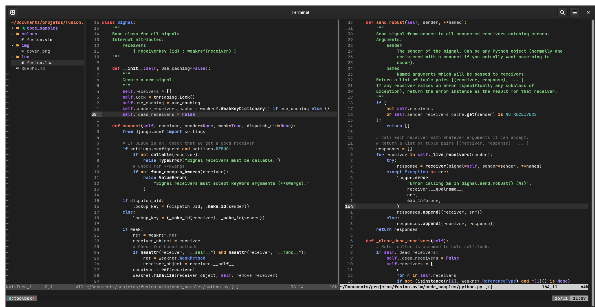

```
        ___           ___           ___                       ___           ___     
       /\__\         /\  \         /\__\                     /\  \         /\  \    
      /:/ _/_        \:\  \       /:/ _/_       ___         /::\  \        \:\  \   
     /:/ /\__\        \:\  \     /:/ /\  \     /\__\       /:/\:\  \        \:\  \  
    /:/ /:/  /    ___  \:\  \   /:/ /::\  \   /:/__/      /:/  \:\  \   _____\:\  \ 
   /:/_/:/  /    /\  \  \:\__\ /:/_/:/\:\__\ /::\  \     /:/__/ \:\__\ /::::::::\__\
   \:\/:/  /     \:\  \ /:/  / \:\/:/ /:/  / \/\:\  \__  \:\  \ /:/  / \:\~~\~~\/__/
    \::/__/       \:\  /:/  /   \::/ /:/  /   ~~\:\/\__\  \:\  /:/  /   \:\  \      
     \:\  \        \:\/:/  /     \/_/:/  /       \::/  /   \:\/:/  /     \:\  \     
      \:\__\        \::/  /        /:/  /        /:/  /     \::/  /       \:\__\    
       \/__/         \/__/         \/__/         \/__/       \/__/         \/__/
    
```

Neovim Fusion is a dark colorscheme for Neovim written in Lua featuring highly ~~radioactive~~ vibrant colors. As far as sanity is concerned, Fusion uses the _In-Your-Face_ principle as much as possible, bringing to focus totally unimportant details of your programming language of choice. 



## Installation

Note that there are basically two flavours of NeoVim Fusion available:
- Branch `main`: using the definitions provided by [nvim-tree-sitter](https://github.com/nvim-treesitter/nvim-treesitter) generic syntax;
- Branch `vim-polyglot`: using the definitions provided by [vim-polyglot](ihttps://github.com/sheerun/vim-polyglot) (this was intended as the original version, but it was later replaced by the tree-sitter implementation).

We don't recommend the installation, but in case you have the bad idea of installing it here's how it goes:

1. Inside your `plugins.lua` add the following:

```lua
return packer.startup(function(use)
  -- ...
  use {"lfenzo/fusion.nvim", branch = "main"} -- or `branch = "vim-polyglot"` for the vim-polyglot branch
  -- ...
  if PACKER_BOOTSTRAP then
    require("packer").sync()
  end
end)
```

2. Add the following your `init.lua` or equivalent:

```lua
vim.cmd[[colorscheme fusion]]
```
