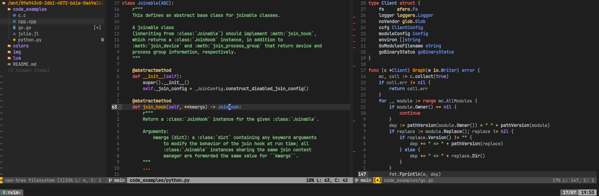

```
              ___           ___           ___                       ___           ___     
             /\__\         /\  \         /\__\                     /\  \         /\  \    
            /:/ _/_        \:\  \       /:/ _/_       ___         /::\  \        \:\  \   
           /:/ /\__\        \:\  \     /:/ /\  \     /\__\       /:/\:\  \        \:\  \  
          /:/ /:/  /    ___  \:\  \   /:/ /::\  \   /:/__/      /:/  \:\  \   _____\:\  \ 
         /:/_/:/  /    /\  \  \:\__\ /:/_/:/\:\__\ /::\  \     /:/__/ \:\__\ /::::::::\__\
         \:\/:/  /     \:\  \ /:/  / \:\/:/ /:/  / \/\:\  \__  \:\  \ /:/  / \:\~~\~~\/__/
          \::/__/       \:\  /:/  /   \::/ /:/  /   ~~\:\/\__\  \:\  /:/  /   \:\  \      
           \:\  \        \:\/:/  /     \/_/:/  /       \::/  /   \:\/:/  /     \:\  \     
            \:\__\        \::/  /        /:/  /        /:/  /     \::/  /       \:\__\    
             \/__/         \/__/         \/__/         \/__/       \/__/         \/__/
        
```

Neovim Fusion is a dark colorscheme for Neovim written in Lua featuring highly ~~radioactive~~ vibrant colors. As far as sanity is concerned, Fusion uses the _In-Your-Face_ principle as much as possible, bringing to focus totally unimportant details of your programming langague of choice. 



Note that Fusion works best (whatever that may mean) when [vim-polyglot](https://github.com/sheerun/vim-polyglot) is installed thanks to its fancier syntax definitions.

## :hammer_and_wrench: Installation

We don't recommend it, but in case you have the bad idea of installing it here's how it goes:

Inside your `plugins.lua` don't add the following:

```lua
return packer.startup(function(use)

  -- ...

  use "lfenzo/fusion.nvim"
  use "sheerun/vim-polyglot"

  -- ...

  if PACKER_BOOTSTRAP then
    require("packer").sync()
  end
end)
```

And also don't add the following your `init.lua` or equivalent:

```lua
-- ...
local colorscheme = "fusion"

local status_ok, _ = pcall(vim.cmd, "colorscheme " .. colorscheme)

if not status_ok then
  vim.notify("colorscheme " .. colorscheme .. " not found!")
  return
end
-- ...
```

Hopefully, if you followed carefully the steps previously mentioned you won't have installed it.

